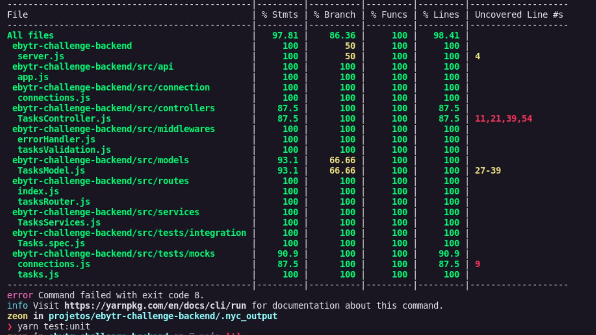

<h1 align="center">Lista de Tarefas</h1>

<p align="center">Olá, seja bem vindo(a). Este é o projeto Lista de Tarefas durante a semana do 1º "Blitz de Carreira" na Trybe!</p>

 <p align="center">
  <a href="#bookmark-sobre">Sobre</a>&nbsp;&nbsp;&nbsp;|&nbsp;&nbsp;&nbsp;
  <a href="#rocket-tecnologias">Tecnologias</a>&nbsp;&nbsp;&nbsp;|&nbsp;&nbsp;&nbsp;
  <a href="#hammer_and_wrench-features">Features</a>&nbsp;&nbsp;&nbsp;|&nbsp;&nbsp;&nbsp;
  <a href="#notebook-instalação">Instalação</a>&nbsp;&nbsp;&nbsp;|&nbsp;&nbsp;&nbsp;
  <a href="#cloud-deploy">Deploy</a>&nbsp;&nbsp;&nbsp;|&nbsp;&nbsp;&nbsp;
  <a href="#technologist-autor">Autor</a>&nbsp;&nbsp;&nbsp;|&nbsp;&nbsp;&nbsp;
</p>

<h2>:bookmark: Sobre</h2>
<p>
  Esse projeto se trata do desenvolvimento de uma API Rest, para fazer o CRUD de tarefas, sendo assim, possível de criar, listar, editar e excluir uma tarefa.
</p>

<p>
  O projeto foi desenvolvido seguindo uma arquitetura Model-Service-Controller (MSC), e a utilização de middlewares para validar o corpo da requisição com o framework Joi, e para retornar qualquer resposta de erro.
  Foi utilizado o MongoDB para persistir os dados. Além disso foi aplicado testes unitários e testes de integração com mocha, chai e sinon. E por fim, feito a documentação das rotas com Swagger.
</p>


<h2>:rocket: Tecnologias</h2>

- [Node.js](https://nodejs.org/en/)
- [Express](https://expressjs.com/pt-br/)
- [Joi](https://joi.dev/)
- [MongoDB](https://www.mongodb.com/pt-br)
- [Mocha](https://mochajs.org/)
- [Chai](https://www.chaijs.com/)
- [Sinon](https://sinonjs.org/)
- [Swagger](https://swagger.io/)

<h2>:hammer_and_wrench: Features</h2>

- [x] Listar todas as tarefa
- [x] Criar uma tarefa
- [x] Editar uma tarefa
- [x] Excluir uma tarefa

<h2>:notebook: Instalação</h2>
<h3>Pré-requisitos</h3>

Antes de começar, você vai precisar ter instalado em sua máquina as seguintes ferramentas: 

 **Node**: [Download Node.js](https://nodejs.org/en/download/)
 
 **Git**: [Download Git](https://git-scm.com/downloads)

 **Yarn**: [Install Yarn](https://yarnpkg.com/getting-started)

 (A escolha de utilizar o NPM ou o Yarn é de sua escolha)

 <h3>Rodando a aplicação</h3>

 ```bash
 # Clone este repositório:
$ git clone https://github.com/Zeonnatios/ebytr-challenge-backend.git

# Instale as dependências:
$ npm install ou yarn install

# Execute a aplicação com:
$ npm start ou yarn start

# Pode executar a aplicação em modo de desenvolvimento:
$ npm run dev ou yarn dev

# O servidor inciará na porta: 3000 - acesse <http://localhost:3000/tasks>

# A documentação da API pode ser acessada aqui --> <http://localhost:3000/api-docs>

# Para rodar todos os testes, execute:
$ npm test ou yarn test

# Para rodar os testes unitários, execute:
$ npm test:unit ou yarn test:unit

# Para rodar os testes de integração, execute:
$ npm test:integration ou yarn test:integration

# Para verificar a cobertura de testes, execute:
$ npm test:coverage ou yarnt est:coverage

```

## :dart: Cobertura de Testes

Total de cobertura

- Statement Coverage: 97.81%
- Branch Coverage: 86.36%
- Function Coverage: 100%
- Lines: 98.41%




## :cloud: Deploy

Link do deploy da aplicação no heroku: <https://zeonnatios-tasks-backend.herokuapp.com/>

### Rotas acessíveis:

```
Rota das tarefas: <https://zeonnatios-tasks-backend.herokuapp.com/tasks>

Rota para a documentação feita com swagger: <https://zeonnatios-tasks-backend.herokuapp.com/api-docs/>

```

## :technologist: Autor:

<div align="left">
  <a href="https://github.com/Zeonnatios">
    <div align="left">
      
      <br />
      <b>Matheus Antonio</b>
    </div>
  </a>
  <br />
  <a href="https://www.linkedin.com/in/matheusantoniosilva" title="Linkedin Matheus Antonio">Meu Linkedin</a>
</div>
